<div align="center">

# ⚡ SPECTRA v2

### *Frictionless AI-Orchestrated DeFi on Stellar*

<br/>

[](https://stellar.org)
[](#team)
[](LICENSE)
[]()

<br/>


</div>

---

## 📋 Table of Contents

1. [The Vision](#the-vision)
2. [Market Problem](#market-problem)
3. [Business Model](#business-model)
4. [Architecture Overview](#architecture-overview)
5. [The Architectural Transition](#the-architectural-transition)
6. [AI Orchestration Engine](#ai-orchestration-engine)
7. [Gasless Execution Layer](#gasless-execution-layer)
8. [Smart Contracts: Profile & NFT SaaS](#smart-contracts-profile--nft-saas)
9. [Exchange & Cross-Chain Bridge](#exchange--cross-chain-bridge)
10. [Frontend Architecture](#frontend-architecture)
11. [Project Structure](#project-structure)
12. [Environment Setup](#environment-setup)
13. [Blockchain Innovation](#blockchain-innovation)
14. [Team Falcons](#team-falcons)

---

## The Vision

**Spectra v2** is a fully on-chain, AI-orchestrated DeFi operating system built on the Stellar blockchain. It allows users to express financial intent in plain language — "Swap 50 XLM for EURC" — and have an autonomous AI agent parse, validate, preview with live charts, and execute the transaction **gaslessly on Stellar Testnet**, all without the user ever writing a single piece of code or navigating a complex DEX UI.

The core thesis: **The wallet is the platform. The agent is the interface. The blockchain is the backend.**

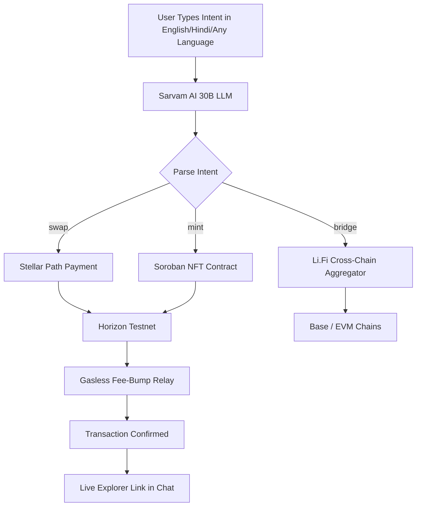

---

## Market Problem

The DeFi space sits at a critical inflection point. Despite $50B+ in daily on-chain volume, **retail adoption remains stubbornly low** due to three hard blockers:

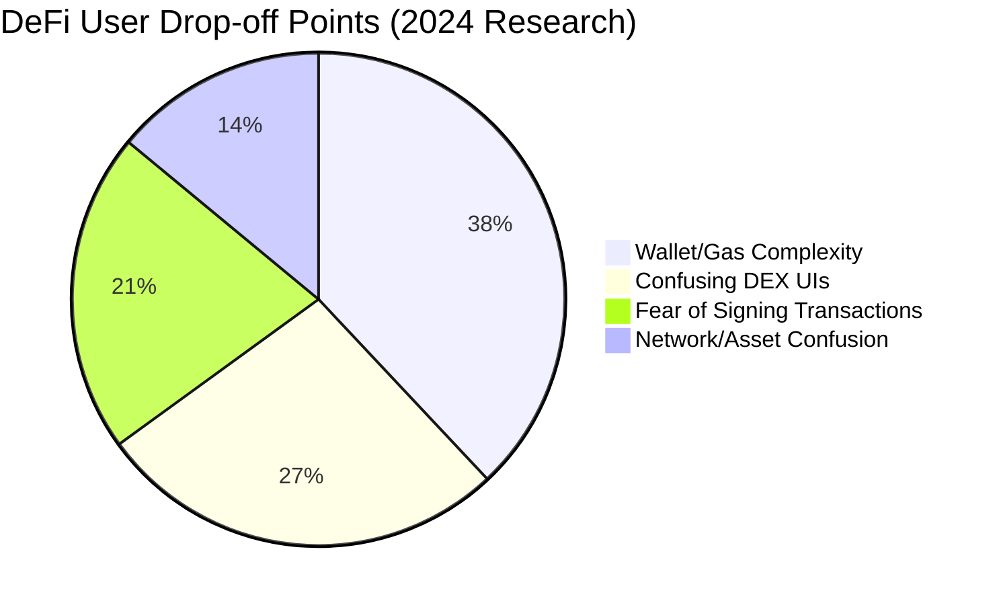

### Core Pain Points

| Problem | Current Reality | Spectra Solution |
|---|---|---|
| **Gas Friction** | Users need XLM/ETH just to start | Fee-Bump relay sponsors all fees |
| **Intent Translation** | Users must know token symbols, slippage, AMM curves | Sarvam AI parses natural language |
| **Cross-Chain Complexity** | 4-6 manual bridge steps | Single agent command routes through Li.Fi |
| **Blind Signing** | Users sign without price context | TradingView chart appears inline before confirmation |
| **Account Abstraction** | Smart wallets require setup | Freighter native + gasless relayer works day one |

### Market Opportunity

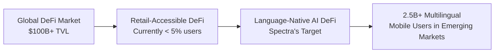

Emerging markets — India, Southeast Asia, Africa — represent the largest untapped DeFi audience. They're mobile-first, multilingual, and underserved by existing English-centric DeFi tooling. Spectra's Sarvam AI integration (built in India, optimized for Indic languages) speaks their language — literally.

---

## Business Model

Spectra operates a **Subscription-Gated SaaS model on-chain**, where access tiers are tokenized as Stellar Classic Assets and verified through Soroban smart contracts — no centralized database required.

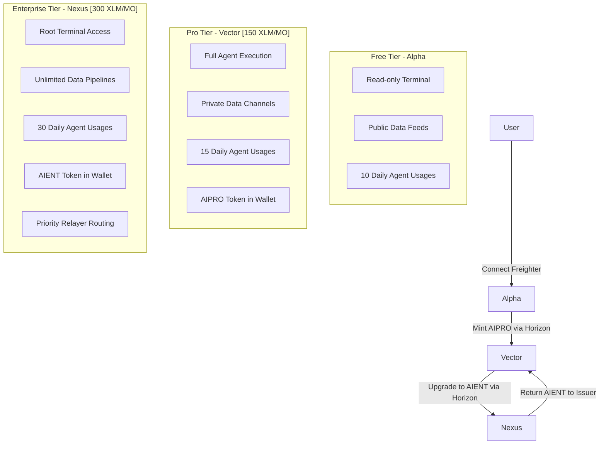

### Tokenomic Flow

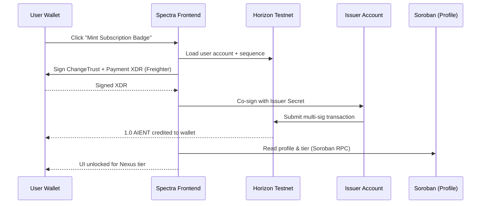

**Revenue Streams:**
- Monthly subscription in XLM (deflationary utility)
- Agent usage fees (per-query at scale)
- Relayer fee margin (sponsored tx fees + small spread)
- Cross-chain bridge aggregation commission (via Li.Fi fee structure)

---

## Architecture Overview

Spectra v2 is built as a **layered, modular architecture** separating AI cognition, blockchain execution, and SaaS verification into distinct, composable layers.

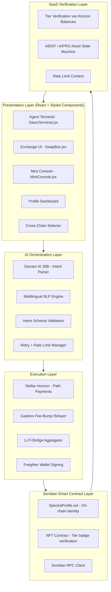

---

## The Architectural Transition

This section documents the **critical engineering decision** at the heart of Spectra v2: the migration from a fully Soroban-smart-contract-based execution model to a **hybrid AI-orchestrated + relayer-aggregator model** that preserves Soroban contracts only where they add irreplaceable value.

### Phase 1: Original Architecture (Soroban-First)

In the original design, every on-chain action — swapping tokens, paying subscription fees, reading balances — was routed through Soroban smart contracts using the Stellar SDK's contract invocation client.

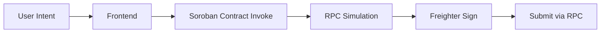

**Problems encountered:**
- Soroban SAC (Stellar Asset Contracts) were often unfunded or undeployed on Testnet
- `Error(WasmVm, MissingValue)` — contract functions missing from deployed WASM
- `Error(Contract, #1)` — re-entrant calls failing due to simulation vs actual state mismatch  
- `Error(Contract, #10)` — zero balance edge cases in SAC transfer operations
- Soroban RPC simulation lag caused 3-8 second delays per operation

### Phase 2: The Hybrid Pivot

After extensive debugging, the team made a **deliberate, principle-driven architectural decision**:

> *"Use Soroban smart contracts where they provide irreplaceable value (identity, SaaS proofs, NFT verification). Use Stellar's classical Horizon API for everything else — it is battle-tested, instant, and 100% reliable on Testnet."*

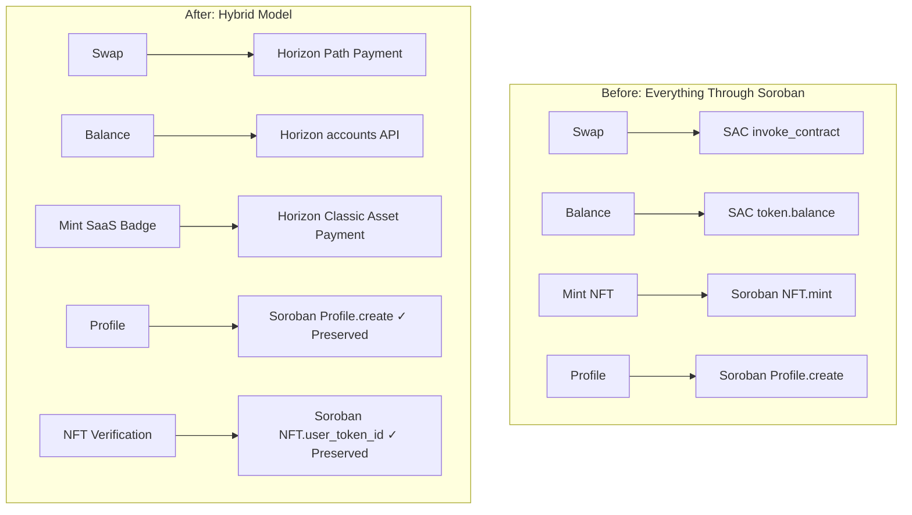

### Decision Matrix: What Stays on Soroban

| Operation | Soroban | Horizon Classical | Reason |
|---|---|---|---|
| **User Profile (create/update/read)** | ✅ Preserved | ❌ | Censorship-resistant on-chain identity |
| **NFT Tier Verification** | ✅ Preserved | ❌ | Tamper-proof badge ownership proof |
| **Token Swaps (XLM/USDC/EURC)** | ❌ Removed | ✅ Path Payment | Faster, more reliable, less gas |
| **XLM Balance Read** | ❌ Removed | ✅ `/accounts/{id}` | Instant, no simulation needed |
| **Subscription Mint/Burn** | ❌ Removed | ✅ Classic Asset Ops | Simpler multi-sig pattern |
| **Cross-Chain Bridge** | ❌ N/A | ❌ N/A | ✅ Li.Fi Aggregator |

---

## AI Orchestration Engine

The **Sarvam AI 30B** model serves as Spectra's cognitive core — the layer that translates raw human intent into structured, executable blockchain transactions.

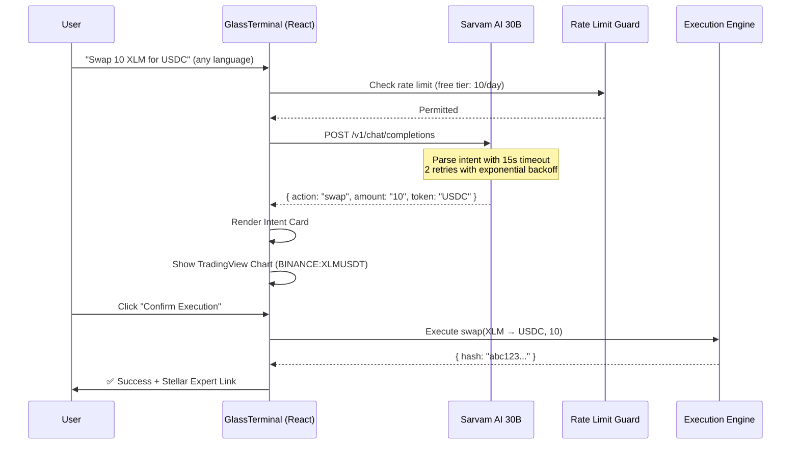

### Intent Schema

The AI engine outputs a strictly typed JSON object validated against a DeFi action schema:

```json
{
  "action": "swap | mint | burn | bridge | transfer | stake | lend | borrow",
  "amount": "10",
  "token": "USDC"
}
```

**Multilingual Support:** The Sarvam 30B model natively processes prompts in Hindi, Marathi, Tamil, Spanish, French, German and returns structured English JSON regardless of input language — enabling DeFi access for billions of non-English speakers.

### Rate Limiting Architecture

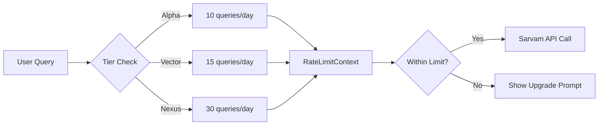

---

## Gasless Execution Layer

Spectra's **Gasless Relayer** is one of its most significant blockchain innovations. Users on Testnet — and in production — never need to hold XLM specifically for gas fees.

### Fee-Bump Transaction Pattern (CAP-0015)

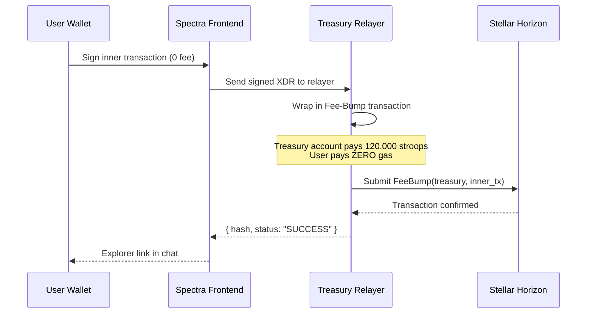

**Implementation:** [`gaslessExecution.ts`](src/lib/stellar/gaslessExecution.ts)

```typescript
// Wraps any user-signed XDR in a Stellar Fee-Bump transaction
export async function relayGaslessTransaction(signedXdr: string): Promise<GaslessRelayResult> {
  const feeBumpTx = TransactionBuilder.buildFeeBumpTransaction(
    treasuryKeypair,
    '120000', // 0.012 XLM sponsored per transaction
    innerTransaction,
    networkPassphrase
  );
  feeBumpTx.sign(treasuryKeypair);
  return await server.submitTransaction(feeBumpTx);
}
```

This leverages **Stellar's native CAP-0015 Fee-Bump mechanism** — no custom relay contracts, no L2 infrastructure, no trusted intermediary smart contracts. Pure protocol-level account abstraction.

---

## Smart Contracts: Profile & NFT SaaS

While execution was migrated to classical Stellar, two Soroban contracts remain as the **trust anchors** of the Spectra platform:

### 1. SpectraProfile — On-Chain Identity

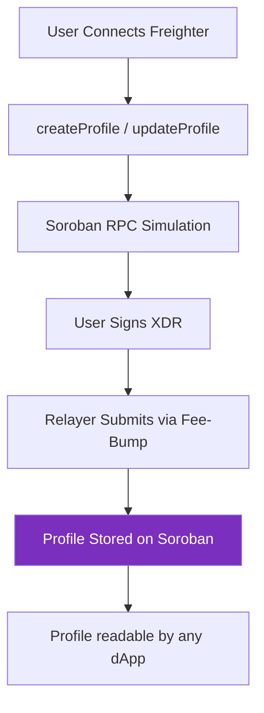

The Profile contract stores:
- `name`, `email`, `phone`, `bio` — user identity
- `avatarId` — chosen avatar (0-9)
- `exists` — boolean flag for first-time creation gating

**Contract Address:** `CAIVPYSHCJTMYFOCLLNJXY33377SWJLEIIYQY53UFSU6HJDTEVMATCIJ` (Testnet)

**Why Soroban for Profile?**
Because on-chain identity is the one data type that must be censorship-resistant, universally readable by any Stellar dApp, and provably owned by the wallet. A Horizon asset can't store structured data. A database can be deleted. A Soroban contract cannot.

### 2. NFT Contract — SaaS Tier Verification

The NFT contract provides cryptographic proof of subscription tier ownership:

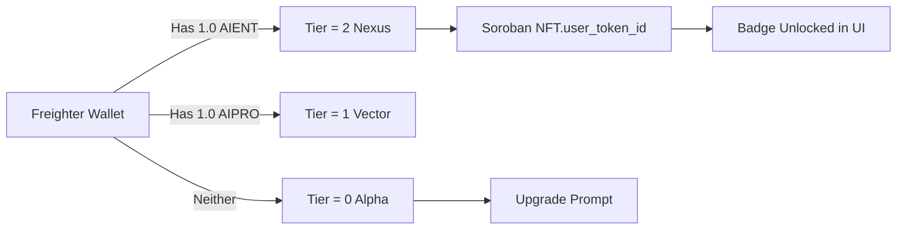

**Verification Flow:**
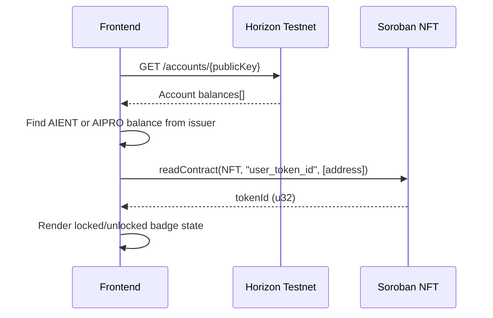

**Why Hybrid?** Tier *verification* stays on Soroban (tamper-proof). Tier *minting* uses classical Horizon multi-sig asset payments (reliable, instant, no simulation errors).

---

## Exchange & Cross-Chain Bridge

### On-Chain Swap via Stellar Path Payment

The exchange engine uses **Stellar's native Horizon Path Payment Strict Send** — the most efficient on-chain swap primitive available:

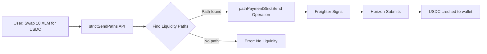

**Supported Assets (Testnet):**

| Asset | Type | Identifier | SAC Contract |
|---|---|---|---|
| **XLM** | Native | `native` | `CDLZFC3...GCYSC` |
| **USDC** | Classic | `USDC:GBBD47...` | `CCW67C...C4K5` |
| **EURC** | Classic | `EURC:GB3Q6...` | `CCUUDM...MCGZ` |

### Cross-Chain Bridge Architecture

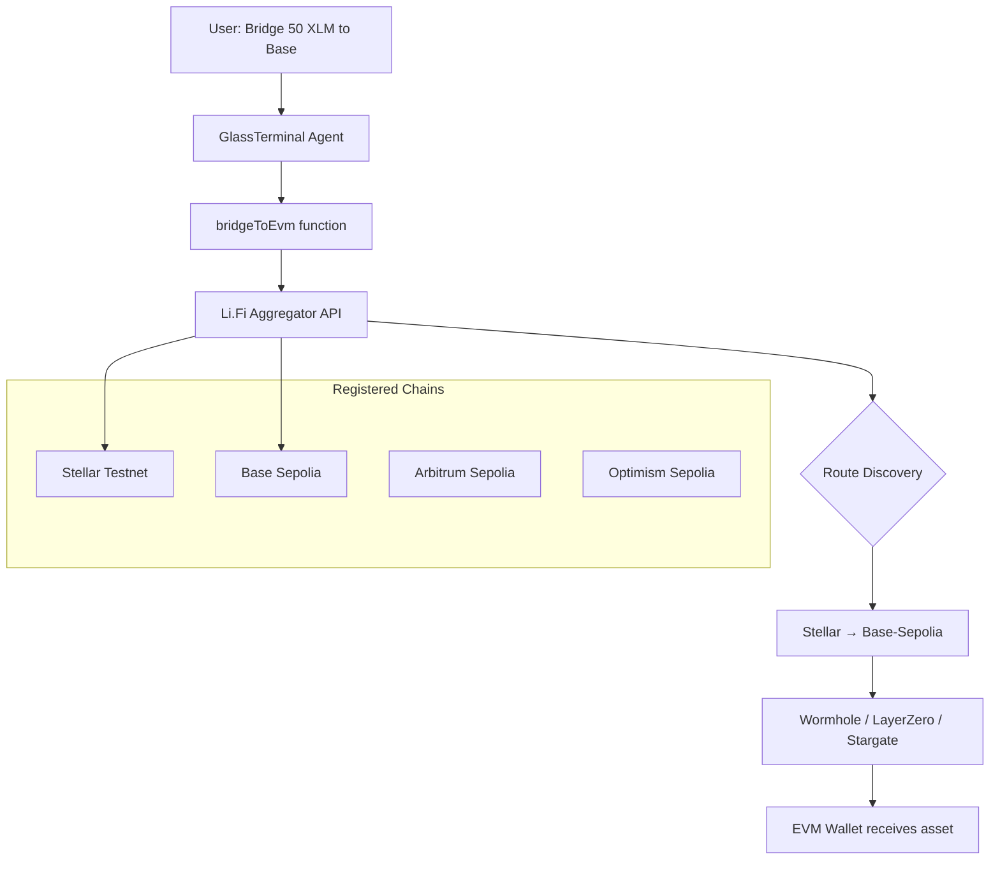

**Li.Fi Integration:** [`lib/bridge/lifiAggregator.js`](src/lib/bridge/lifiAggregator.js) — queries Li.Fi's aggregation API to discover optimal cross-chain routes across all major bridges, returning best-price paths without the user needing to know which bridge protocol is used.

---

## Frontend Architecture

Spectra's UI is built on a **Neobrutalist × Dark Glass** design system — a deliberate aesthetic that signals technical credibility while remaining visually arresting.

```mermaid
graph TD
    subgraph "App Shell"
        A[React Router v6]
        B[AuthContext - Wallet + Profile State]
        C[ErrorContext - Global Error Boundary]
        D[RateLimitContext - Agent Usage Tracking]
    end

    subgraph "Pages"
        P1[/ - Home - 3D Spline Landing]
        P2[/agent - AI Terminal]
        P3[/exchange - Swap + Bridge]
        P4[/mint - Subscription NFT Engine]
        P5[/profile - On-chain Identity]
        P6[/journal - Transaction History]
        P7[/about - Manifesto]
    end

    subgraph "Key Components"
        C1[GlassTerminal - AI Chat + Intent Execution]
        C2[SwapBox - DEX Interface]
        C3[MintConsole - SaaS Badge Minting]
        C4[PricingMatrix - Tier Comparison]
        C5[CrossChainSelector - Bridge UI]
        C6[ProfileDashboard - On-chain Profile CRUD]
    end

    A --> B --> C --> D
    A --> P1 & P2 & P3 & P4 & P5 & P6 & P7
    P2 --> C1
    P3 --> C2 & C5
    P4 --> C3 & C4
    P5 --> C6
```

### Design System

- **Typography:** Geist + Geist Mono (Vercel's typeface, perfect for terminal aesthetics)
- **Color Language:** Deep blacks (`#0A0A0C`), electric violet (`#B026FF`), emerald success (`#10B981`)
- **Glassmorphism:** `backdrop-filter: blur(16px)` panels with translucent borders
- **Animation:** Keyframe geometric spinners, pulse glows for active states
- **Charts:** TradingView embedded widget — live market data before every trade confirmation

---

## Project Structure

```
spectrav2/
├── src/
│   ├── api/
│   │   ├── sarvamAgent.js          # Sarvam 30B intent parser (NLP → JSON)
│   │   └── x402Client.ts           # HTTP 402 payment protocol client
│   │
│   ├── config/
│   │   └── contracts.js            # SAC addresses, network config, token decimals
│   │
│   ├── context/
│   │   ├── AuthContext.jsx          # Wallet state, tier, profile, upgradeTier/cancelTier
│   │   ├── ErrorContext.jsx         # Global error boundary + dialog
│   │   └── RateLimitContext.jsx     # Agent usage rate tracking per tier
│   │
│   ├── lib/
│   │   ├── stellar/
│   │   │   ├── client.js            # Soroban RPC client + contract invoker
│   │   │   ├── gaslessExecution.ts  # CAP-0015 Fee-Bump relayer
│   │   │   ├── relayer.js           # Relay routing utilities
│   │   │   └── contracts/
│   │   │       ├── profile.js       # Soroban SpectraProfile read/write
│   │   │       ├── nft.js           # Soroban NFT mint/burn/verify
│   │   │       ├── exchange.js      # Horizon Path Payment swap
│   │   │       ├── token.js         # Soroban token balance reader
│   │   │       ├── bridge.js        # EVM bridge initiation
│   │   │       └── feedback.js      # On-chain feedback contract
│   │   │
│   │   └── bridge/
│   │       ├── lifiAggregator.js    # Li.Fi multi-chain bridge aggregator
│   │       ├── intentParser.js      # Bridge-specific intent parser
│   │       └── registryService.js   # Supported chain + token registry
│   │
│   ├── services/
│   │   ├── mintAsset.js             # Horizon multi-sig mint/burn transactions
│   │   └── tierVerification.js      # Horizon balance → tier level resolver
│   │
│   ├── components/
│   │   ├── agent/
│   │   │   └── GlassTerminal.jsx    # Full AI agent chat + execution terminal
│   │   ├── exchange/
│   │   │   ├── SwapBox.jsx          # Token swap UI
│   │   │   └── CrossChainSelector.jsx # Bridge chain/token selector
│   │   ├── mint/
│   │   │   ├── MintConsole.jsx      # Badge mint/cancel interface
│   │   │   └── PricingMatrix.jsx    # Tier comparison card grid
│   │   └── layout/
│   │       └── ErrorDialog.jsx      # Glassmorphic error alert modal
│   │
│   └── pages/
│       ├── Agent.jsx                # /agent route wrapper
│       ├── Exchange.jsx             # /exchange — swap + TradingView charts
│       ├── Mint.jsx                 # /mint route wrapper
│       ├── ProfileDashboard.jsx     # /profile — Soroban identity CRUD
│       ├── Journal.jsx              # /journal — transaction log
│       ├── About.jsx                # Project manifesto
│       └── Home.jsx                 # Landing (3D Spline scene)
│
├── contracts/
│   └── src/
│       └── SpectraProfile.sol       # Solidity reference (Soroban Rust version deployed)
│
├── scripts/
│   └── setup-issuer.js              # Issuer account funding + trustline setup
│
├── .env.example                     # All required env variables documented
└── vite.config.js                   # Vite + proxy config (Sarvam AI CORS bypass)
```

---

## Environment Setup

```bash
# Clone
git clone https://github.com/Precise-Goals/Spectrav2.git
cd Spectrav2

# Install
bun install

# Configure
cp .env.example .env
```

### Required Environment Variables

| Variable | Description | Example |
|---|---|---|
| `VITE_SARVAM_API_KEY` | Sarvam AI subscription key | `sarvam_...` |
| `VITE_STELLAR_RPC_URL` | Soroban RPC endpoint | `https://soroban-testnet.stellar.org` |
| `VITE_STELLAR_HORIZON_URL` | Horizon API base | `https://horizon-testnet.stellar.org` |
| `VITE_STELLAR_NETWORK_PASSPHRASE` | Network passphrase | `Test SDF Network ; September 2015` |
| `VITE_PROFILE_CONTRACT_ID` | SpectraProfile Soroban ID | `CAIVPY...` |
| `VITE_SAAS_ISSUER_PUBLIC_KEY` | SaaS asset issuer G-address | `GCXCTJ...` |
| `VITE_SAAS_ISSUER_SECRET_KEY` | Issuer signing key (backend) | `S...` |
| `VITE_STELLAR_TREASURY_SECRET` | Gasless relayer treasury | `S...` |
| `VITE_STELLAR_SAC_XLM` | XLM SAC contract address | `CDLZFC...` |
| `VITE_STELLAR_SAC_USDC` | USDC SAC contract address | `CCW67C...` |
| `VITE_STELLAR_SAC_EURC` | EURC SAC contract address | `CCUUDM...` |

```bash
# Run development server
bun dev

# Production build
bun run build
```

---

## Blockchain Innovation

### What Makes Spectra Architecturally Unique

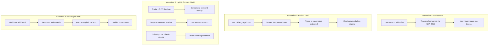

### Comparison with Existing Solutions

| Feature | Spectra v2 | Uniswap | MetaMask Swaps | Squid Router |
|---|---|---|---|---|
| **Natural Language Input** | ✅ Any language | ❌ | ❌ | ❌ |
| **Gasless Execution** | ✅ Fee-Bump relay | ❌ | ❌ | ❌ |
| **On-chain Identity** | ✅ Soroban Profile | ❌ | ❌ | ❌ |
| **SaaS on Blockchain** | ✅ Tokenized tiers | ❌ | ❌ | ❌ |
| **Chart Before Sign** | ✅ Inline TradingView | Separate tab | ❌ | ❌ |
| **Cross-Chain Bridge** | ✅ Li.Fi aggregator | ❌ | Partial | ✅ |
| **Multilingual NLP** | ✅ Sarvam 30B | ❌ | ❌ | ❌ |

---

## Team Falcons

> Built for **Stellar Build Station Pune** — India's premier Stellar hackathon event.

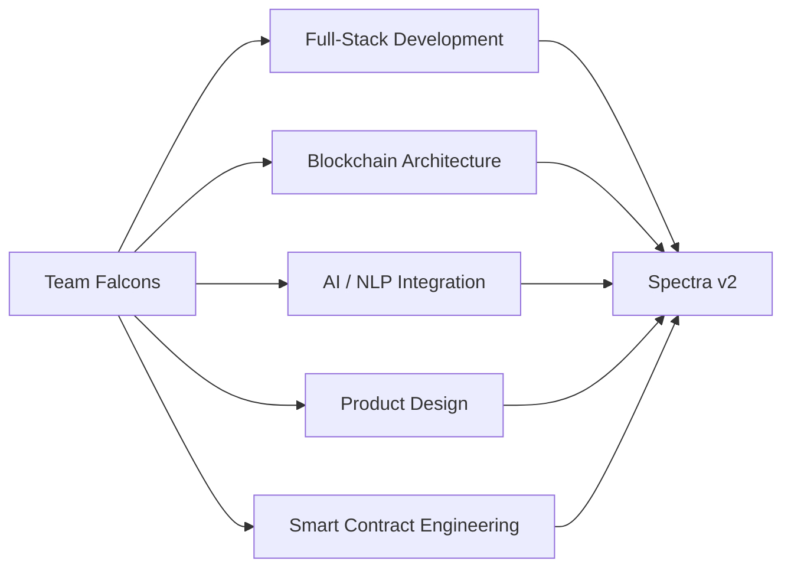

**Team Falcons** is a group of builders passionate about the intersection of AI and decentralized finance. We believe the next billion DeFi users won't come from Silicon Valley — they'll come from Mumbai, Pune, Bangalore, and beyond. They speak Hindi. They don't know what a gas fee is. And they deserve access to the same financial primitives as anyone else.

Spectra is our answer.

---

## Technical Acknowledgements

 — For CAP-0015 Fee-Bump transactions enabling gasless UX

 — For India-native multilingual LLM powering the agent

 — For cross-chain route discovery and aggregation

 — For inline pre-trade market context

 — For native Stellar signing integration

---

<div align="center">

**Built with ⚡ by Team Falcons**

*Stellar Build Station Pune · 2026*

[](https://github.com/Precise-Goals/Spectrav2)

</div>
